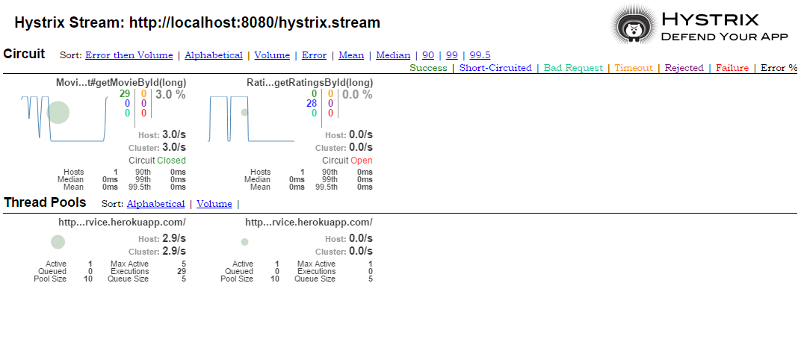

# Design For Failure

In this exercise, you learn how to use Hystrix to make your application more resilient. Hystrix provides many configuration options. You can find details and explanations about these options [here](https://github.com/Netflix/Hystrix/wiki/Configuration).

### Load Test

To check that your Hystrix configuration works correctly you should use this [LoadTest](https://github.com/mat1/movie-ticket-service/blob/master/src/test/java/com/zuehlke/movie/MovieControllerLoadIT.java). Copy the test to your test folder and remove the @Ignore annotation during this exercise.

### Timeouts

The **MovieControllerLoadIT** test fails sometimes, because some calls reach the timeout configured in Hystrix. Your task is to increase the default Hystrix timeout to 5 Seconds.

### Fallback

The `GET /api/v1/movies/1` call fail if the rating service is not available. Implement a fallback function so that if the rating service is not available an empty rating list is returned. You should use the fallback functionality from Feign for this [see](https://github.com/OpenFeign/feign/tree/master/hystrix).

If you have implemented the fallback correctly, the load test should pass.

### Bulkhead

Now it is time to play around with the different Hystrix thread pools. First find out how big are the default Hystrix thread pools? What happens if you reduce the thread pools, so that no more threads are available to call an external service?

### Circuit Breaker

Your task is to configure the circuit breaker **only** for the `Movie Rating Service`. Trip (open) the circuit-breaker if 2 from 4 calls fails in the last 20 seconds. Can you see what happens if the circuit breaker is open?

### Bonus: Hystrix Dashboard

Hystrix provides a dashboard for monitoring Hystrix metrics like thread pools and circuit breakers.



Add the Hystrix dashboard to your Spring Boot Application and see what happens if you increase the load.
You can use the **MovieControllerLoadIT** for that. But you have to modify the test like in the example below:

> __Note__: You need to add spring-boot-starter-actuator, spring-cloud-starter-hystrix and spring-cloud-starter-hystrix-dashboard as dependency in your pom.xml. And you have to @EnableHystrix and @EnableHystrixDashboard to see the dashboard.

Useful links for local development:

| Links               | Url           |
| --------------------- | ------------- |
| Dashboard        | http://localhost:8080/hystrix        |
| Hystrix Stream   | http://localhost:8080/hystrix.stream  |

```java
public class MovieControllerLoadIT {

    private static final int NUMBER_OF_REQUESTS = 30;
    private static final int THREADS = 5;

    @Test
    public void getMovieByIdLoadTest() throws Exception {
        ExecutorService executor = Executors.newFixedThreadPool(THREADS);

        List<Future<ResponseEntity<String>>> futureResults = new LinkedList<>();

        for(int i = 0; i < NUMBER_OF_REQUESTS; i++) {
            futureResults.add(executor.submit(this::getMovieById));
        }

        List<ResponseEntity<String>> results = futureResults.stream().map(r -> {
            try {
                return r.get();
            } catch (Exception e) {
                return error();
            }
        }).collect(toList());

        executor.shutdown();
        executor.awaitTermination(10, TimeUnit.SECONDS);

        printResults(results);

        assertThat(results.stream().allMatch(r -> r.getStatusCode().is2xxSuccessful()), is(true));
    }

    private void printResults(List<ResponseEntity<String>> results) {
        System.out.println("Result Summary");
        results.forEach(r -> System.out.printf("HttpStatus=%d HttpResponse=%s \n", r.getStatusCodeValue(), r.getBody()));
    }

    private ResponseEntity<String> getMovieById() {
        try {
            RestTemplate restTemplate = new RestTemplate();
            String url = "http://localhost:" + 8080 + "/api/v1/movies/1";
            return restTemplate.getForEntity(url, String.class);
        } catch (Exception ex) {
            ex.printStackTrace();
        }
        return error();
    }

    private ResponseEntity<String> error() {
        return new ResponseEntity<>(HttpStatus.INTERNAL_SERVER_ERROR);
    }

}
```
